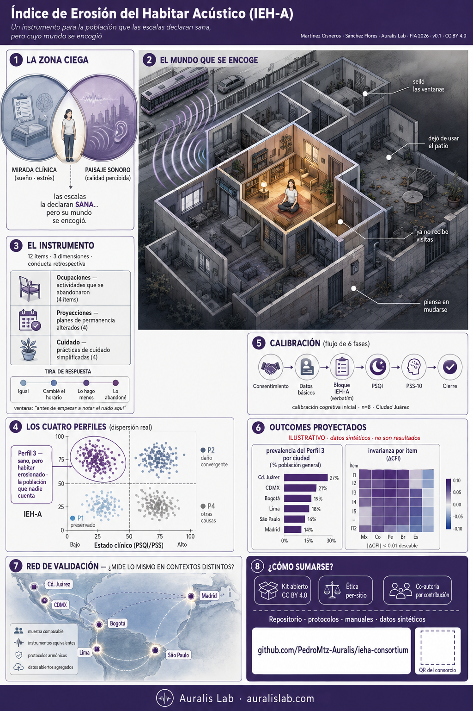

# Lámina-resumen del IEH-A — síntesis gráfica del instrumento y del consorcio

Resumen gráfico (graphical abstract de alta densidad) que condensa, en una sola pieza, **qué mide el IEH-A, a quién, cómo se calibra y por qué importa** que una red distribuida lo valide. Pensado como **suplemento de lectura en pantalla** (repositorio / materiales digitales), donde la densidad conceptual es una fortaleza y el lector puede acercarse a cada panel.

Material complementario al manuscrito FIA 2026 · Consorcio IEH-A · Auralis Lab · CC BY 4.0.

---

## Cómo leer la lámina

La pieza recorre el argumento completo del instrumento en ocho módulos:

1. **La zona ciega** — entre la mirada clínica (sueño, estrés) y el paisaje sonoro (calidad percibida) queda un habitante al que las escalas declaran **sano**, pero cuyo mundo se encogió.
2. **El mundo que se encoge** — la metáfora-ancla: el entorno acústico recorta lo que una persona todavía hace, va y disfruta (selló ventanas, dejó de usar el patio, ya no recibe visitas, piensa en mudarse).
3. **El instrumento** — 12 ítems · 3 dimensiones (Ocupaciones, Proyecciones, Cuidado) · conducta retrospectiva, no autoevaluación.
4. **Los cuatro perfiles** — al cruzar estado clínico (PSQI/PSS) con IEH-A, emerge el **Perfil 3: clínicamente sano, habitar erosionado** — *la población que nadie cuenta*.
5. **Calibración** — el flujo de fases del levantamiento (consentimiento → datos básicos → bloque IEH-A → PSQI → PSS-10 → cierre).
6. **Outcomes proyectados** — prevalencia del Perfil 3 e invarianza por ítem.
7. **Red de validación** — la pregunta que solo una red iberoamericana puede responder: *¿mide lo mismo en contextos distintos?*
8. **Cómo sumarse** — kit abierto (CC BY 4.0) · ética per-sitio · coautoría por contribución · `github.com/PedroMtz-Auralis/ieha-consortium`.

El gancho que une todo: **"clínicamente sano, mundo encogido"** (el Perfil 3).

---

## Guardrails (lectura obligatoria)

- Los **outcomes** mostrados en la lámina (prevalencia del Perfil 3, invarianza por ítem) son **datos sintéticos rotulados "ILUSTRATIVO"** — coherentes con [`../projected_outcomes/`](../projected_outcomes/). **No son resultados** y no deben citarse como hallazgos.
- Encuadre de **estudio de dos investigadores** (Martínez Cisneros · Sánchez Flores · Auralis Lab); sin inferencia doctoral, sin aprobación ética inventada.
- La calibración inicial reportada corresponde al **pretest cognitivo de Auralis Lab** (v0.1); la validación distribuida es, precisamente, lo que el consorcio convoca.

## Variantes y procedencia

Esta es la **variante editorial clara** de la lámina, seleccionada como suplemento formal del repositorio por su registro sobrio (fondo blanco, alta legibilidad de panel). Existe además una variante de **alto contraste** para difusión en redes, gestionada fuera de este repositorio.

> Los **materiales de producción** (prompts de generación de imagen, guion/handoff de video) son herramientas internas de Auralis Lab y **no** se versionan en este repositorio público — consistente con la política de `outreach/README.md`.
