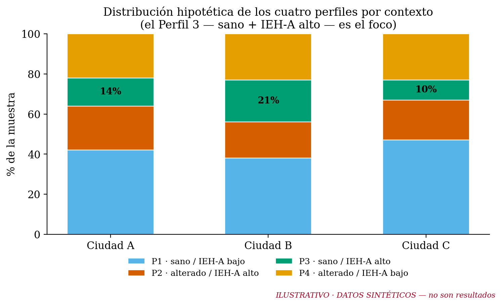
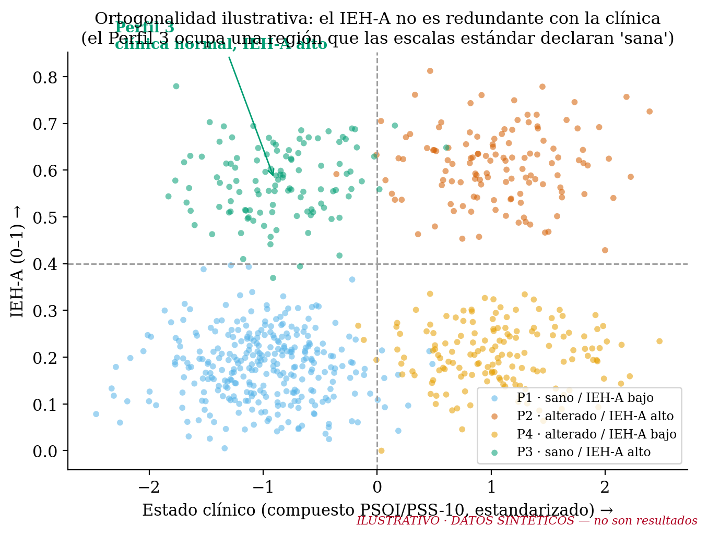
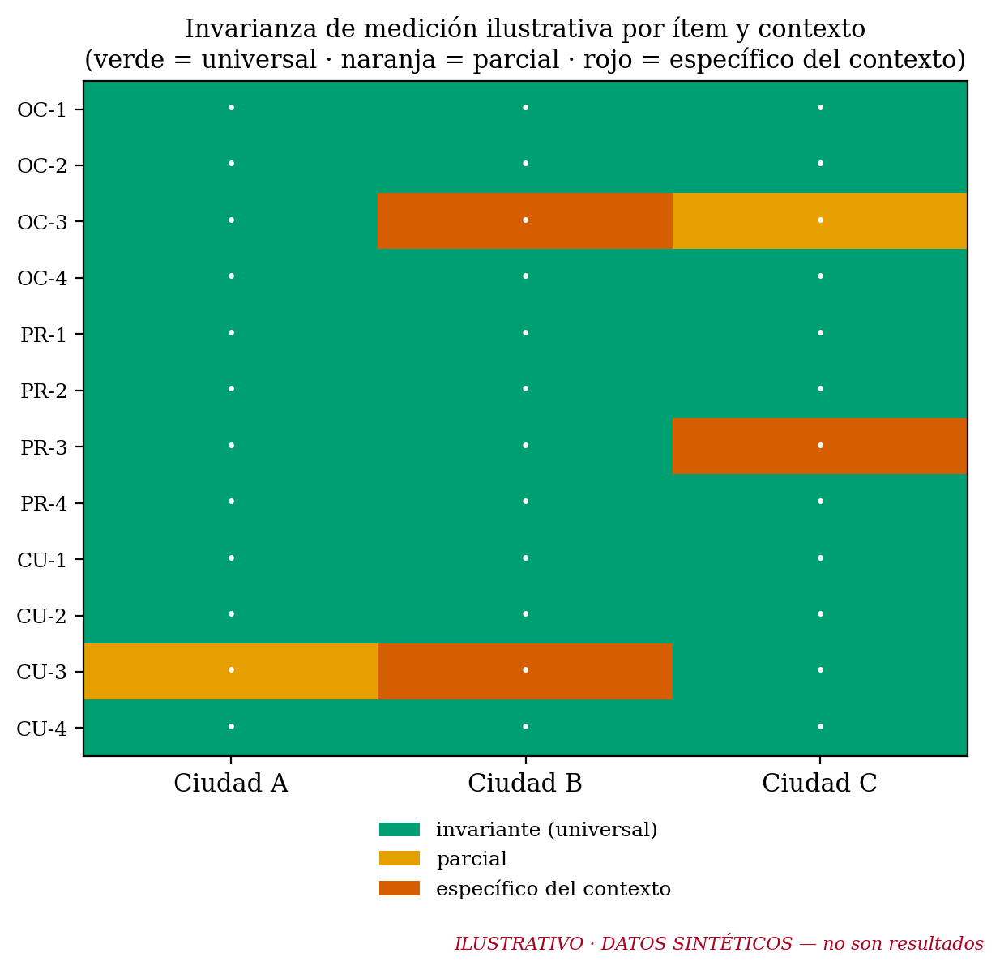
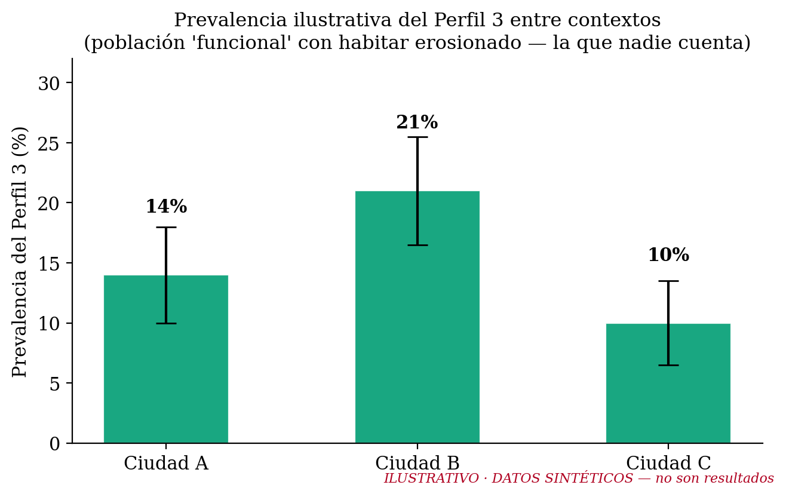

# Outcomes proyectados del IEH-A — qué *podría* revelar una validación distribuida

> ⚠️ **LECTURA OBLIGATORIA.** Este documento y sus figuras usan **datos sintéticos** generados con una semilla fija (`generate_projected_figures.py`). **NO son resultados, NO provienen de ningún levantamiento, y NO deben citarse como hallazgos.** Su único propósito es **ilustrar el tipo de evidencia** que una validación multi-sitio del IEH-A podría producir, para que equipos potenciales vean el payoff de sumarse. Cada figura lleva el rótulo *"ILUSTRATIVO · DATOS SINTÉTICOS"*.

Material complementario al manuscrito FIA 2026 · Consorcio IEH-A · Auralis Lab · CC BY 4.0.

---

## Por qué este suplemento

El IEH-A es un índice nuevo. Su aporte —identificar al habitante **clínicamente funcional cuyo mundo práctico se ha contraído** (Perfil 3)— solo se vuelve tangible cuando se ve *qué pinta* tendría la evidencia. Este documento proyecta, con datos simulados, los cuatro tipos de resultado que la validación distribuida está diseñada para producir. No adelanta conclusiones: adelanta **preguntas con forma de figura**.

## 1. ¿Cuánta gente vive en el Perfil 3, y varía entre contextos?

*Lo que la validación respondería:* qué proporción de cada población cae en cada perfil, y **cuánto varía el Perfil 3 entre territorios**. Si —como sugiere la hipótesis— una fracción no trivial de habitantes "sanos" tiene el habitar erosionado, la población objetivo de la gestión acústica es **más amplia** que la que los umbrales clínicos identifican. *(Cifras ilustrativas.)*

## 2. ¿El IEH-A añade información, o es estrés con otro nombre?

*La prueba de fuego del instrumento.* Si el IEH-A fuera redundante con PSQI/PSS-10, no habría un grupo en la esquina **clínica-baja / IEH-A-alto**. La existencia de ese cluster —el Perfil 3— es lo que demuestra que el índice **mide algo que la clínica no ve**. La validación lo prueba con varianza incremental y modelos jerárquicos sobre datos reales multi-sitio. *(Cluster ilustrativo.)*

## 3. ¿Mide lo mismo en poblaciones de origen distinto?

*La pregunta que solo una red puede responder.* La invarianza de medición distingue los ítems **universales** del constructo de los **específicos del contexto**. El resultado no es solo "validó / no validó": es un **mapa de qué parte del habitar acústico es común a la condición humana urbana y qué parte depende del lugar** — y orienta el refinamiento del instrumento (v0.3). *(Patrón ilustrativo.)*

## 4. El número que mueve política pública

*El titular potencial.* Una prevalencia del Perfil 3 estimada con intervalos de confianza, comparable entre contextos, es la cifra que un tomador de decisiones entiende: **"X % de la población funcional vive con el habitar erosionado por ruido"**. Es el puente del instrumento hacia el diagnóstico territorial y la priorización de intervenciones. *(Prevalencia ilustrativa.)*

---

## Cómo se generan estas figuras (reproducible)

`python outreach/projected_outcomes/generate_projected_figures.py` → 4 PNG en `figures/`. Semilla fija; paleta Okabe-Ito (daltónico-segura). **Reemplazar por datos reales solo tras la validación**, retirando entonces el rótulo "ILUSTRATIVO".

## Súmate a producir los datos reales

Estas figuras son una promesa, no un resultado. Convertirlas en evidencia es, precisamente, la invitación del consorcio: **`github.com/PedroMtz-Auralis/ieha-consortium`**.
